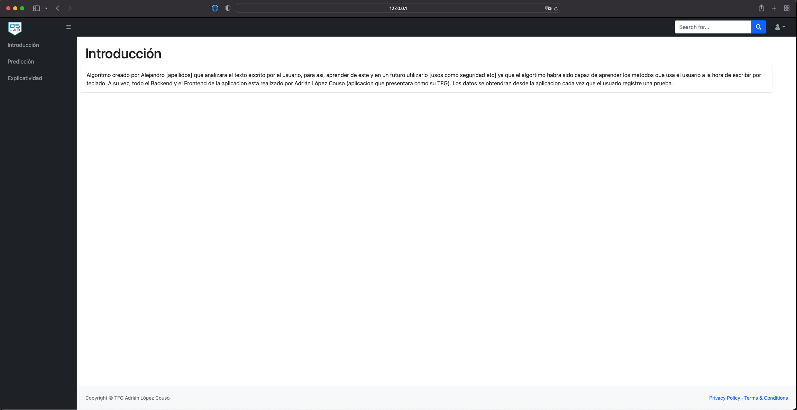
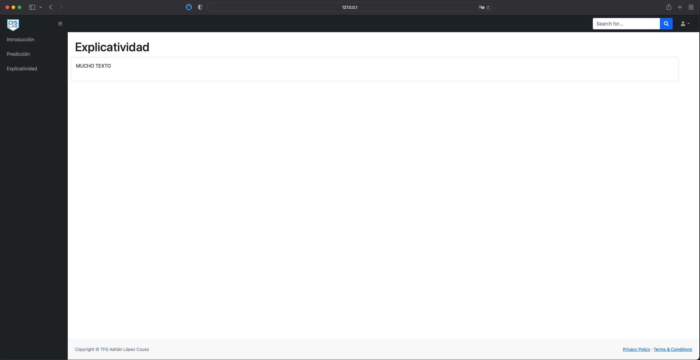
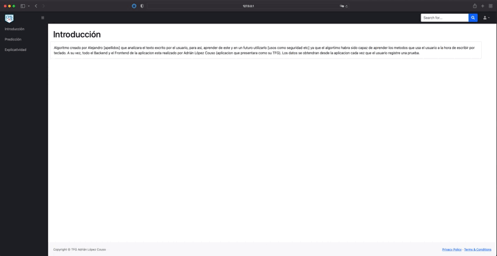
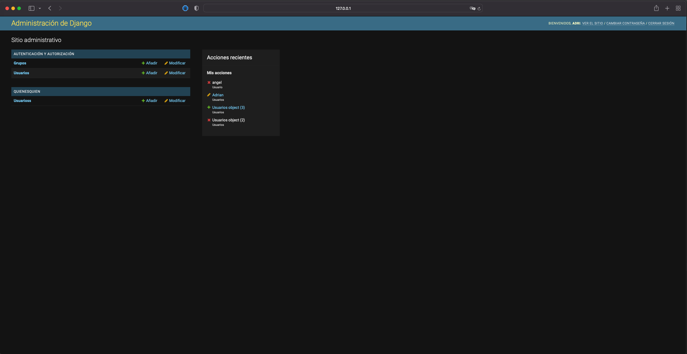
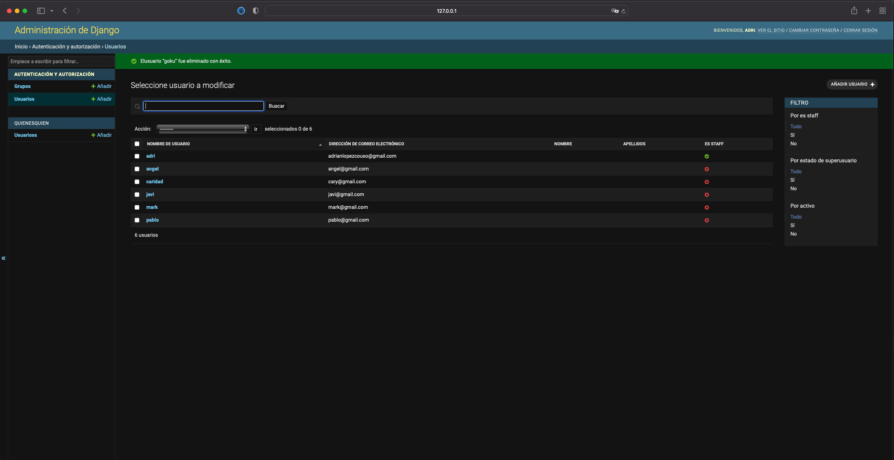
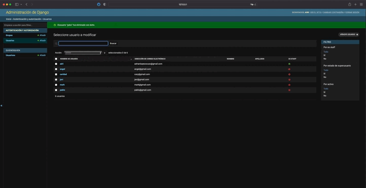

# quienEsQuien

Members | Email | GitHub | LinkedIn
:------------: | :-----: | :------: | :-----:
Adrián López Couso | adrianlopezcouso@gmail.com | Adriton1 | https://www.linkedin.com/in/adrian-l%C3%B3pez-couso-657988180/

### COORDINATION APP:
https://trello.com/b/Q4gxKaU5/tfg

### MODELS:
- **User:** model made to contain the client data.
- **User prediction:** model that contains all the data related to the user prediction, How long did it take the user to perform the test?, How many times did the user press the Key-Back?, How many times did the user press the Key-Space?, ...

### USER TYPES:
- **Guest User:** Unregistered users will be able to navigate throughout the web page to see the app but, they wont be allowed to make the prediction (This template will be hide for this users).
- **Registered user:** The registered user will be able to perform everything the guest user can do, plus being able to make the prediction (This template will be showed to the registered users).
- **Admin:** He will be able perform everything the registered user can do, but he can also add, modify or delete users, and users predictions.


### ALGORITHM:
The app will be able to find out which user is typing once the prediction has been made. 3 base cases must be loaded so that, the first user to register in the app can carry out the prediction test with more cases analyzed apart from their own.


## PHASE 1


In this page the users will be able to create a new account if they don't already have one.


This is the login where user will be able to log in to the web application if they have an existing account.


If something goes wrong with the login, the user will be redirected to this page and try again the login.


If the users forget their passwords, they will be redirected to this page to get an email to change their password.


This page display the information related to the application: Application developer, algorithm developer and what programming language has been used to develop it.


This page display a test text, the user must write the same text in the space below. The algorithm will analyze your writing: speed, errors, time it takes to perform the test, etc.


This page display the information related to the algorithm: How does it work? How does the algorithm analyze the data that is provided?...


The App will use a Hamburger menu to show and hide the navbar.



The App will use a Dropdown to show and hide the login and logout option.


This page display the information related to the control panel: Users and User prediction's data


This page display the information related to the users. Admins can add, modify, and delete users from this page. They can also filter by data or search users by their name or email.



As I said in the last picture, admins can filter by data or search users.

## PHASE 2
In this phase, some templates have been modified, although some of them have never been modified, such as:
- **Forgotten password page:** 
- **Login Error:** 
- **Control panel:** 

On the other hand, the templates that have undergone some modification will be:

 

As can be seen, the form to be filled in has been visually modified. One of the aspects to highlight is that the user must comply with certain requirements when creating the password (do not use the user name in the password, it must have a minimum length, etc.).


Added the option to log in as a guest, now, you can browse the site without being registered (although you will not be able to access some features that will be available to registered users).


Also, we will be able to see in the lower left corner the name of the user who has just logged in. If you are logged in as a guest, you will see the word "Invitado".


Finally, every time we log in or log out, a message will be displayed indicating this action.


We have added a text (which the user must type) and an empty text area that will be filled in letter by letter each time the user types correctly. In addition, a button has been added which, once clicked, will start the test.


A proprietary code has been designed using the functions keyup, keydown and keypress in JavaScript. These functions are able to capture an event (in this case, the keys of our keyboard). Once the event is captured, we will be able to access its timestamp attribute. This attribute will return the time at which the key has been pressed. In our case, the time will be shown in seconds and will start counting at the moment when the "Iniciar prueba" button is pressed.


Once we have typed the text completely, the test will end. In this version of the web application, we will be able to see how many mistakes we have made and the time we have taken to write both the text and each letter.


## HOW TO RUN THE APP

To run the app we will have to dockerized it. Follow the next steps to do it.
- 1: install docker desktop and docker compose [click here](https://desktop.docker.com/win/stable/amd64/Docker%20Desktop%20Installer.exe?utm_source=docker&utm_medium=webreferral&utm_campaign=dd-smartbutton&utm_location=header)
- 2: download project in GitHub [click here](https://github.com/Adriton1/quienEsQuien/archive/refs/heads/master.zip)
- 3: Open terminal
- 4: Get into the Backend directory ```cd C:\{your download path}```
- 5: Build image in docker ```docker-compose up --build ```
- 6: Then we will have to run the app and migrate the ddbb ```docker-compose run web python3 manage.py migrate```
- 7: Type in the browser https://localhost:8000/ and it will show the login template.

